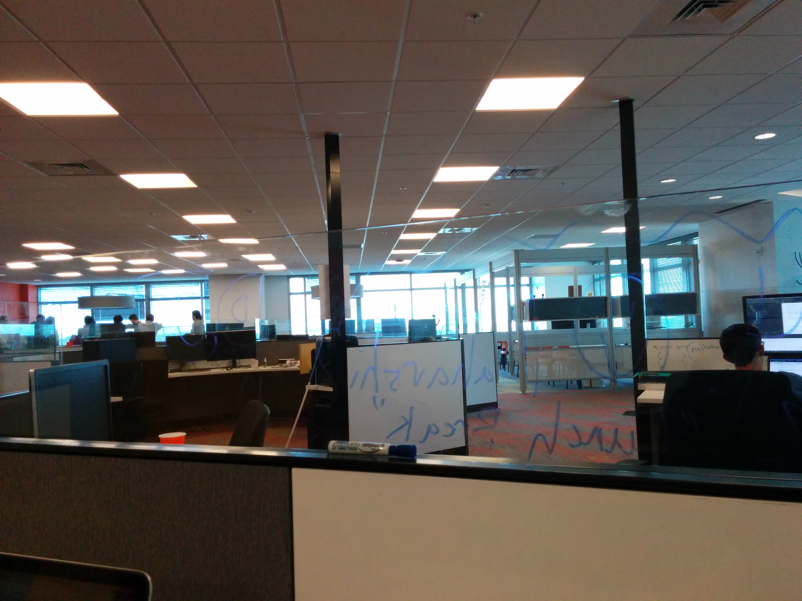
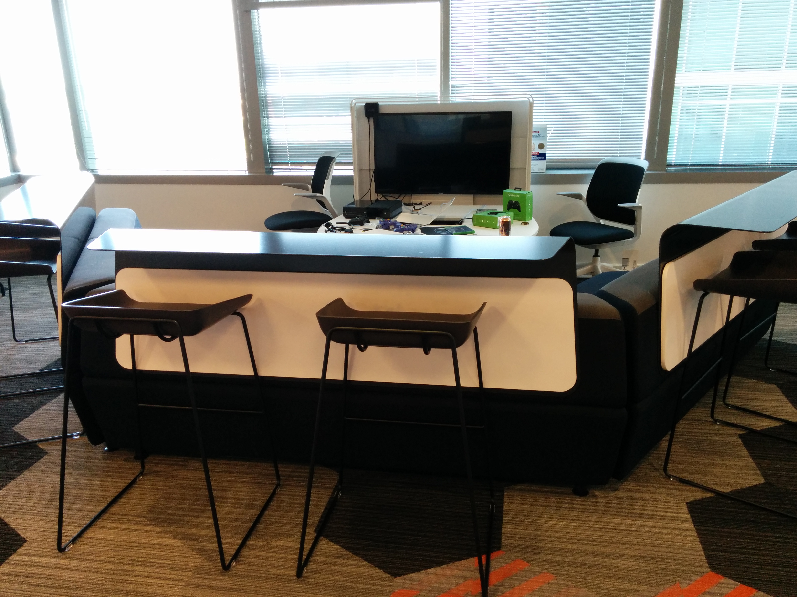
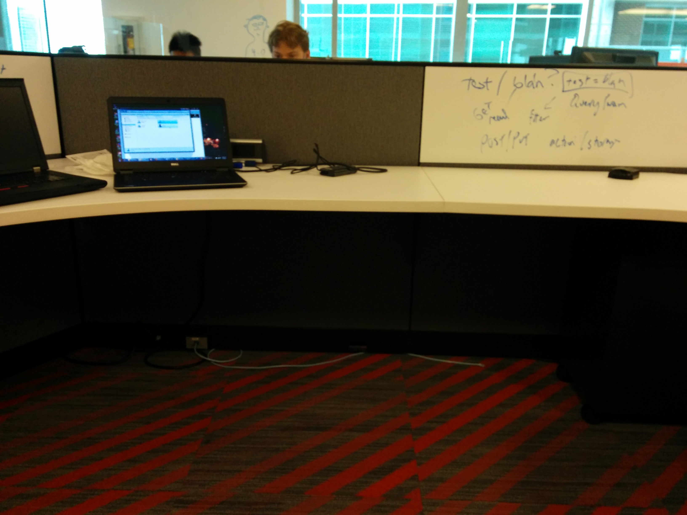
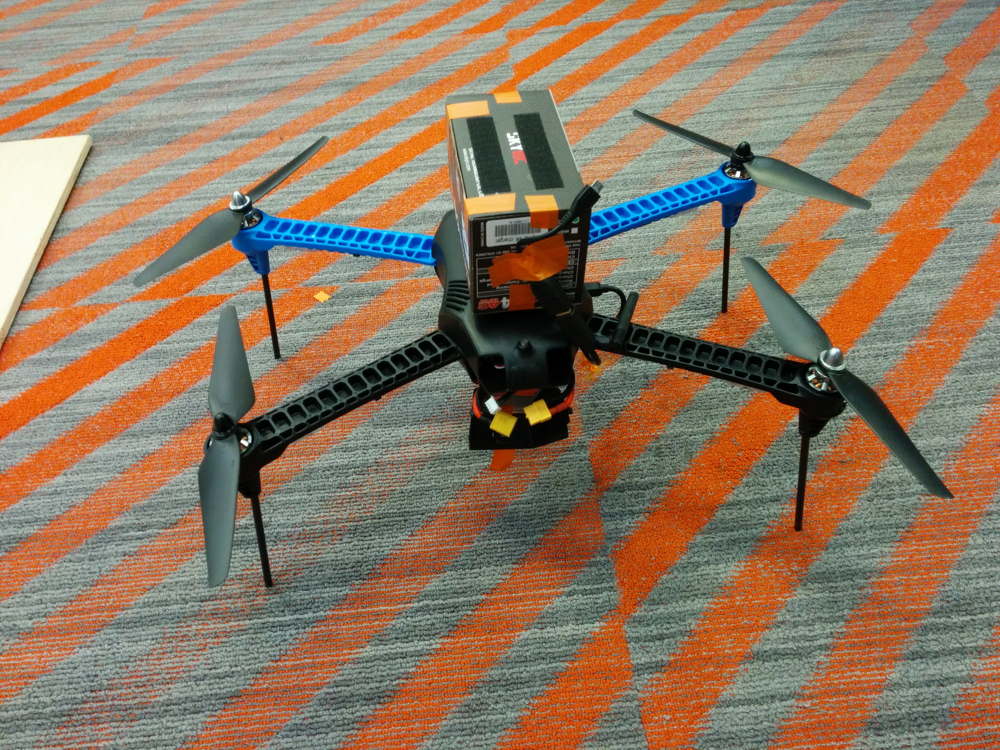



  

      

          <ul>
            <li></li>
            <li></li>
            <li></li>
            <li></li>
            
          </ul>
      

      <a href="#" class="jcarousel-control-prev">&lsaquo;</a>
      <a href="#" class="jcarousel-control-next">&rsaquo;</a>
      
      <!-- 

          
      
 -->
  

<!---##Some Title
write something here. 

###Another Title
somethingsomething -->

<!---<ul class="posts">
  
    
    <li><a href="{{ BASE_PATH }}{{ post.url }}">{{ post.title }}</a></li>
    
  
</ul> -->