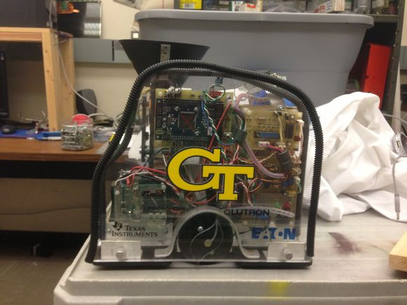
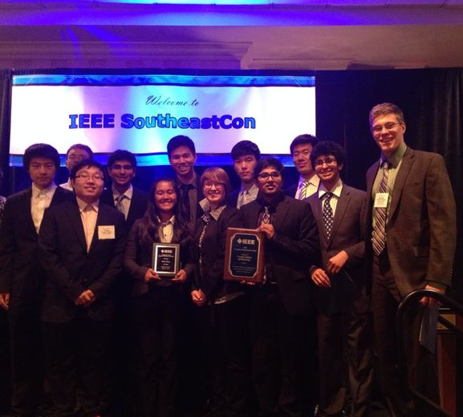
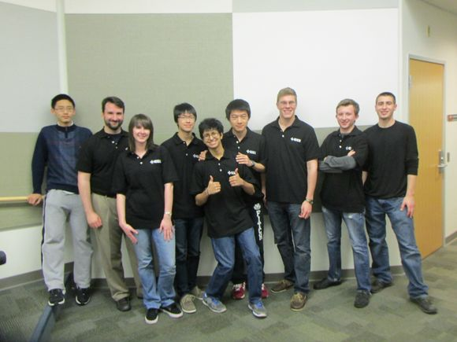
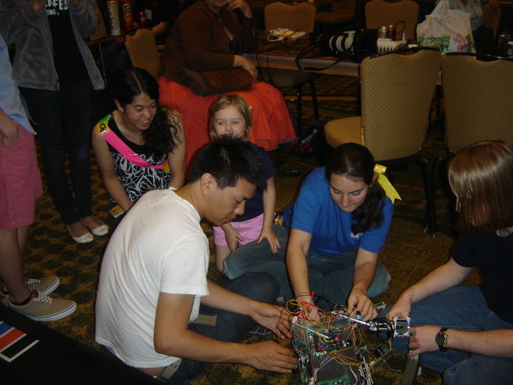
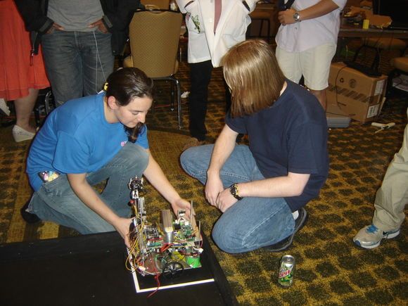
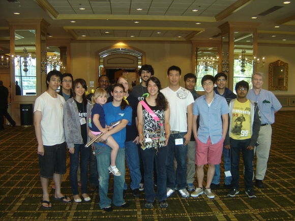
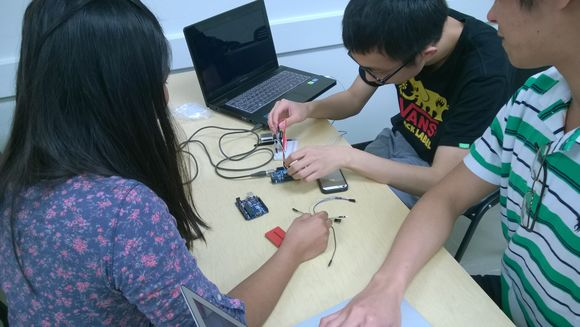
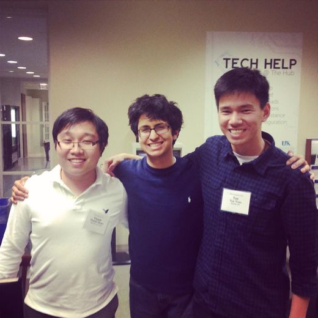



  

      

          <ul>
            <li></li>
            <li></li>
            <li></li>
            <li></li>
            <li></li>
            <li></li>
            <li></li>
            <li></li>
            
          </ul>
      

      <a href="#" class="jcarousel-control-prev">&lsaquo;</a>
      <a href="#" class="jcarousel-control-next">&rsaquo;</a>
      
      <!-- 

          
      
 -->
  

###What's IEEE?

Founded in 1884, The Institute of Electrical and Electronics Engineers is the world's largest technical professional community. IEEE at Georgia Tech is a student branch of National IEEE with over 800 members, making GT IEEE the largest student branch in the nation AND in the <em>western hemisphere</em>. IEEE at Georgia Tech has also been recognized as Outstanding Student Branch of the year and Exemplary Student Branch 4 years running. For a shining future, Georgia Tech IEEE needs you! Don't wait. Join GT IEEE. Your participation shapes the future of GT IEEE.

